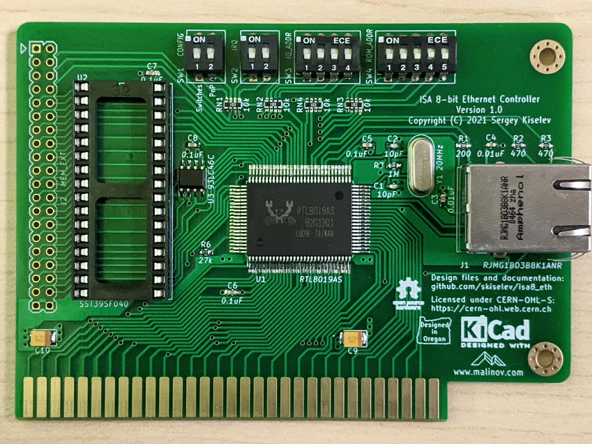
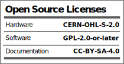

# ISA 8-Bit Ethernet Controller
ISA 8-Bit Ethernet Network Interface Controller

## Introduction
ISA 8-Bit Ethernet Controller is an open source network interface controller (NIC) card, designed specifically to be used in computers with 8-bit only ISA (aka XT) bus, such as IBM* PC, IBM* PC XT, various PC/XT compatibles, for example [Micro 8088](https://github.com/skiselev/micro_8088) system. It is based on Realtek RTL8019 ethernet controller and is NE2000-compatible.

## Specifications
* ISA 8-bit interface (62 pin / card edge)
* NE2000 compatible
  * Note: Popular Crynwr NE2000 pocket driver does not support NE2000 in 8-bit slots. Please use the [patched driver](software/driver/) instead
* Supports configuration using switches, jumperless configuration using [RSET8019](software/RSET8019/) utility or PnP
  * Uses DIP switches instead of jumpers for reliability and ease of configuration
* Boot ROM support
  * Socket supports 512 KiB Flash ROM, such as SST/Microchip 39SF040
  * Can be configured in 16 KiB, 32 KiB, 64 KiB, or page mode. In page mode the entire 512 KiB are accessible through a 16 KiB window
  * Also compatible with other DIP 32-pin Flash ROMs, such as 128 KiB 39SF010A, and 256 KiB 39SF020, or similar
  * 40-pin memory extension connector allows connecting up to 4 MiB of memory that can be used in page mode

## Hardware Documentation

### Schematic and PCB Layout

[Schematic - Version 1.0](KiCad/ISA8_Ethernet-Schematic-1.0.pdf)

[PCB Layout - Version 1.0](KiCad/ISA8_Ethernet-Board-1.0.pdf)

### Building Instructions

#### Assemble the PCB

* Clean the PCB with alcohol
* Apply fluid flux to SMD components pads
* Solder U1 RTL8019 IC
* Solder R1 - R7 resistors and RN1 - RN4 resistor arrays
  * Note that RN1 - RN3 are only required if using DIP switches for configuration. They are not required for jumperless configuration
* Solder C1 - C8 ceramic capacitors
* Solder C9 and C10 tantalum capacitors
* Solder Y1 crystal
* Optional: Program U3 EEPROM. Make sure to use unique MAC address
  * Note: EEPROM can be programmed later using [PG8019](software/PG8019/) utility
* Solder U3 EEPROM
* Optional: Solder SW1 - SW4 DIP switches and U2 IC socket
* Solder J1 Ethernet jack with integrated magentics
* Clean the remaining flux with alcohol

#### Program EEPROM

If EEPROM has not been programmed prior to assembly, now it is a good time to do so.
The U3 EEPROM contains the following configuration for the RTL8019AS chip:
* MAC address
* ISA resources for jumperless configuration
  * Base I/O address
  * IRQ number
  * Boot ROM mode, size, and base memory address
* Other ethernet controller confirguration - medium type, full duplex, LEDs function, power management settings
* Product ID (not normally used, although some vendor specific drivers might check for it)
* Plug and Play data
  * Vendor ID, serial number, PnP version, I/O, memory, and IRQ resources

This information can be programmed using [PG8019](software/PG8019/) utility. The 8019AS.CFG file contains the recommended configuration. Make sure to edit it, and update the MAC address and the serial number. Note that the MAC address is given in the Big-endian format (that is the last byte has the least significant value), while the serial number is given in Little-endian format (that is the first byte has the least significant value). 

A few notes about using PG8019:
* Make sure that your system has 0x300-0x31F I/O addresses available regardless of the Ethernet controller addresses specified in 8019AS.CFG. Note that XT-IDE and XT-CF-Lite frequently use this I/O range. In case you have such a card, you can either temporarily remove it from your system, boot and run PG8019 from a floppy disk, or switch your XT-IDE or XT-CF-Lite to a different address. In the latter case you'll need to update the XT IDE BIOS configuration
* Make sure that your system boots in real mode (no EMM386), or anything else that might interfer with the card. Ideally boot your system without any drivers loaded at all, for example, in later MS-DOS versions it is possible to bypass CONFIG.SYS and AUTOEXEC.BAT by hitting F5 key at the boot time
* After EEPROM has been programmed successfully, the PG8019 utility will print the MAC address, also, it will automatically increment the MAC address and the serial number in 8019AS.CFG, which is useful when programming multiple cards

[Openmoko Inc.](https://github.com/skiselev/openmoko-usb-oui) has generously allocated [00-1F-11-02-60-00 - 00-1F-11-02-7F-FF](https://github.com/skiselev/openmoko-usb-oui/blob/master/ieee_oui.psv) MAC addresses range for ISA 8-Bit Ethernet controller project. You can use MAC addresses from this range for your build, as long as you are using this design. Please apply for a different range if you're redesigning the board or re-using this Ethernet controller design in your own project. I ask you not to use 00-1F-11-02-60-00 - 00-1F-11-02-63-FF range (first 1024 addresses). I am using this range for the cards that I build.

#### Test Ethernet Controller

* Connect Ethernet cable. Make sure that the green "Link" LED lights up
* Use mTCP to test the controller
  * DHCP to obtain IP address
  * FTP or HTGET to download a file

### Switches and Connectors

#### SW1 - CONFIG
This switch block sets the configuration mode

Configuration Mode    | Switch Position
--------------------- | ------------------------
Jumperless / RSET8019 | SW1.1 = OFF, SW1.2 = OFF
Switches              | SW1.1 = ON, SW1.2 = OFF
PnP                   | SW1.1 = OFF, SW1.2 = ON

#### SW2 - IRQ
This switch block, when the card is in the **Switches** configuration mode, sets the Ethernet controller IRQ

IRQ                             | Switch Position
------------------------------- | ------------------------
IRQ2 (on PC/XT) or IRQ9 (on AT) | SW2.1 = OFF, SW2.2 = OFF
IRQ3                            | SW2.1 = ON, SW2.2 = OFF
IRQ4                            | SW2.1 = OFF, SW2.2 = ON
IRQ5                            | SW2.1 = ON, SW2.2 = ON

#### SW3 - IO_ADDR
This switch block, when the card is in the **Switches** configuration mode, sets the Ethernet controller I/O address

I/O Address | SW3.1 | SW3.2 | SW3.3 | SW3.4
----------- | ----- | ----- | ------| -----
0x200       | OFF   | OFF   | ON    | OFF
0x220       | ON    | OFF   | ON    | OFF
0x240       | OFF   | ON    | ON    | OFF
0x260       | ON    | ON    | ON    | OFF
0x280       | OFF   | OFF   | ON    | ON
0x2A0       | ON    | OFF   | ON    | ON
0x2C0       | OFF   | ON    | ON    | ON
0x2E0       | ON    | ON    | ON    | ON
0x300       | OFF   | OFF   | OFF   | OFF
0x320       | ON    | OFF   | OFF   | OFF
0x340       | OFF   | ON    | OFF   | OFF
0x360       | ON    | ON    | OFF   | OFF
0x380       | OFF   | OFF   | OFF   | ON
0x3A0       | ON    | OFF   | OFF   | ON
0x3C0       | OFF   | ON    | OFF   | ON
0x3E0       | ON    | ON    | OFF   | ON

#### SW4 - ROM_ADDR
This switch block, when the card is in the **Switches** configuration mode, sets the Ethernet controller boot ROM address and size

ROM Address  | ROM Size           | SW4.1 | SW4.2 | SW4.3 | SW4.4 | SW4.5
------------ | ------------------ | ----- | ------| ----- | ----- | -----
ROM Disabled | Not applicable     | *     | *     | *     | OFF   | OFF
0xC0000      | 16 KiB             | OFF   | OFF   | OFF   | OFF   | ON
0xC4000      | 16 KiB             | ON    | OFF   | OFF   | OFF   | ON
0xC8000      | 16 KiB             | OFF   | ON    | OFF   | OFF   | ON
0xCC000      | 16 KiB             | ON    | ON    | OFF   | OFF   | ON
0xD0000      | 16 KiB             | OFF   | OFF   | ON    | OFF   | ON
0xD4000      | 16 KiB             | ON    | OFF   | ON    | OFF   | ON
0xD8000      | 16 KiB             | OFF   | ON    | ON    | OFF   | ON
0xDC000      | 16 KiB             | ON    | ON    | ON    | OFF   | ON
0xC0000      | 32 KiB             | OFF   | OFF   | OFF   | ON    | OFF
0xC8000      | 32 KiB             | ON    | OFF   | OFF   | ON    | OFF
0xD0000      | 32 KiB             | OFF   | ON    | OFF   | ON    | OFF
0xD8000      | 32 KiB             | ON    | ON    | OFF   | ON    | OFF
0xC0000      | 64 KiB             | OFF   | OFF   | ON    | ON    | OFF
0xD0000      | 64 KiB             | ON    | OFF   | ON    | ON    | OFF
0xC0000      | 16 KiB / Page mode | OFF   | OFF   | OFF   | ON    | ON
0xC4000      | 16 KiB / Page mode | ON    | OFF   | OFF   | ON    | ON
0xC8000      | 16 KiB / Page mode | OFF   | ON    | OFF   | ON    | ON
0xCC000      | 16 KiB / Page mode | ON    | ON    | OFF   | ON    | ON
0xD0000      | 16 KiB / Page mode | OFF   | OFF   | ON    | ON    | ON
0xD4000      | 16 KiB / Page mode | ON    | OFF   | ON    | ON    | ON
0xD8000      | 16 KiB / Page mode | OFF   | ON    | ON    | ON    | ON
0xDC000      | 16 KiB / Page mode | ON    | ON    | ON    | ON    | ON

#### J1 - Ethernet Connector

#### J2 - MEM_EXT
This connector can be used to add up to 4 MiB of optional memory (ROM or RAM).
The memory, if larger than 64 KiB, can be accessed using the page mode.

Pin | Description   | Pin | Description
--- | ------------- | --- | -----------
1   | 5V            | 2   | 5V
3   | No connection | 4   | A21
5   | No connection | 6   | A20
7   | No connection | 8   | A19
9   | A18           | 10  | /MEMW
11  | A16           | 12  | A17
13  | A15           | 14  | A14
15  | A12           | 16  | A13
17  | A7            | 18  | A8
19  | A6            | 20  | A9
21  | A5            | 22  | A11
23  | A4            | 24  | /MEMR
25  | A3            | 26  | A10
27  | A2            | 28  | /CS
29  | A1            | 30  | D7
31  | A0            | 32  | D6
33  | D0            | 34  | D5
35  | D1            | 36  | D4
37  | D2            | 38  | D3
39  | GND           | 40  | GND

### Bill of Materials - Version 1.0

[ISA 8-bit Ethernet project on Mouser.com](https://www.mouser.com/ProjectManager/ProjectDetail.aspx?AccessID=6373f65c4a) - View and order all components except of the PCB and the Realtek RTL8019 IC.

[ISA 8-bit Ethernet project on OSH Park](https://oshpark.com/shared_projects/OBud8i6u) - View and order the PCB.

Component type     | Reference | Description                           | Quantity | Possible sources and notes 
------------------ | --------- | ------------------------------------- | -------- | --------------------------
PCB                |           | ISA 8-bit Ethernet PCB - Version 1.0  | 1        | Buy from my Tindie store: [ISA 8-bit Ethernet PCB, and optionally a preprogrammed EEPROM](https://www.tindie.com/products/weird/isa8-eth-pcb), or order from a PCB manufacturer of your choice using provided Gerber or KiCad files
Integrated Circuit | U1        | Realtek RTL8019AS Ethernet Controller | 1        | Authorized Realtek distributors or eBay
Integrated Circuit | U2        | SST39SF040 - 512 KiB Flash ROM, 32 pin DIP  | 1  | Optional - Boot ROM. Mouser [804-39SF0407CPHE](https://www.mouser.com/ProductDetail/804-39SF0407CPHE)
Integrated Circuit | U3        | 93C46 - 1 Kbit EEPROM, 4 pin SOIC     | 1        | Mouser [511-M93C46-WMN6TP](https://www.mouser.com/ProductDetail/511-M93C46-WMN6TP)
Quartz Crystal     | Y1        | 20 MHz, 18pF, HC-49U                  | 1        | Mouser [774-ATS200C](https://www.mouser.com/ProductDetail/774-ATS200C)
Ethernet Jack      | J1        | Amphenol RJMG1BD3B8K1ANR - Ethernet jack with magnetics | 1 | Mouser [523-RJMG1BD3B8K1ANR](https://www.mouser.com/ProductDetail/523-RJMG1BD3B8K1ANR)
DIP Switch         | SW1, SW2  | DIP switch, 2 position, SPST          | 2        | Mouser [774-2102MS](https://www.mouser.com/ProductDetail/774-2102MS)
DIP Switch         | SW3       | DIP switch, 4 position, SPST          | 1        | Mouser [774-2104MS](https://www.mouser.com/ProductDetail/774-2104MS)
DIP Switch         | SW4       | DIP switch, 5 position, SPST          | 1        | Mouser [774-2105MS](https://www.mouser.com/ProductDetail/774-2105MS)
Capacitor          | C1, C2    | 10pF MLCC Capacitor, 0603 SMT         | 2        | Mouser [77-VJ0603A100JXACBC](https://www.mouser.com/ProductDetail/77-VJ0603A100JXACBC)
Capacitor          | C3, C4    | 0.01uF MLCC Capacitor, 0603 SMT       | 2        | Mouser [77-VJ0603Y103JXACBC](https://www.mouser.com/ProductDetail/77-VJ0603Y103JXACBC)
Capacitor          | C5 - C8   | 0.1uF MLCC Capacitor, 0603 SMT        | 4        | Mouser [77-VJ0603Y104JXJPBC](https://www.mouser.com/ProductDetail/77-VJ0603Y104JXJPBC)
Capacitor          | C1, C2    | 22uF Tantalum Capacitor, 1210 SMT     | 2        | Mouser [581-TAJB226K016TNJ](https://www.mouser.com/ProductDetail/581-TAJB226K016TNJ)
Resistor           | R1        | 200 Ohm Resistor, 0603 SMT            | 1        | Mouser [603-RC0603FR-13200RL](https://www.mouser.com/ProductDetail/603-RC0603FR-13200RL)
Resistor           | R2, R3    | 470 Ohm Resistor, 0603 SMT            | 2        | Mouser [603-RC0603FR-13470RL](https://www.mouser.com/ProductDetail/603-RC0603FR-13470RL)
Resistor           | R6        | 27 kOhm Resistor, 0603 SMT            | 1        | Mouser [603-RC0603FR-1327KL](https://www.mouser.com/ProductDetail/603-RC0603FR-1327KL)
Resistor           | R7        | 1 MOhm Resistor, 0603 SMT             | 1        | Mouser [603-RC0603FR-131ML](https://www.mouser.com/ProductDetail/603-RC0603FR-131ML)
Resistor Array     | RN1 - RN4 | 10 kOhm x 4 Resistor Array, 0603 SMT  | 4        | Mouser [667-EXB-38V103JV](https://www.mouser.com/ProductDetail/667-EXB-38V103JV)
IC Socket          | U2        | 32 pin DIP                            | 1        | Mouser [517-4832-6000-CP](https://www.mouser.com/ProductDetail/517-4832-6000-CP)

## Reference Information

### Realtek RTL8019AS EEPROM Content

The Realtek RTL8019AS uses 93C46 - 1Kbit / 128 bytes EEPROM to store the configuration. The EEPROM is accessed using 16-bit word mode, with data being stored in Big-endian format. This means that the bytes should be swapped when the EEPROM content is accessed on an x86 system.

Address      | Size | Content                                | Default Configuration for ISA 8-Bit Ethernet
-------------|------|----------------------------------------|---------------------------------------------
0x00 - 0x03  | 4    | CONFIG1, CONFIG2, CONFIG3, CONFIG4     |
0x00         | 1    | CONFIG1                                | 0x07
0x01         | 1    | CONFIG2                                | 0x00
0x02         | 1    | CONFIG3                                | 0xD0
0x03         | 1    | CONFIG4                                | 0x01
0x04 - 0x09  | 6    | Ethernet ID (MAC Address)              | 0x00 0x1F 0x11 0x02 0x70 0x00
0x0A - 0x11  | 8    | Product ID                             | 0x49 0x53 0x41 0x38 0x45 0x54 0x48 0x20
0x12 - 0x1A  | 9    | PnP header                             | 
0x12 - 0x15  | 4    | Vendor ID (0-3)                        |  
0x12 - 0x13  | 2    | Vendor ID - compressed ASCII (00000=A) | 0x4A 0x8C - 0 10010=R 10100=T 01100=L
0x14 - 0x15  | 2    | Vendor ID - product number             | 0x80 0x19 - 8019
0x16 - 0x19  | 4    | Serial Number (0-3)                    | 0x00 0x10 0x00 0x00
0x1A         | 1    | Checksum                               | ?
0x1B - 0x7F  | 101  | PnP Resource Data                      | 
0x1B - 0x1D  | 3    | PnP Version Number                     |
0x1B         | 1    | Item byte                              | 0x0A
0x1C         | 1    | PnP Version                            | 0x10
0x1D         | 1    | Vendor Version                         | 0x10
0x1E - 0x3B  | 37   | ANSI Identifier String                 | 
0x1E         | 1    | Item byte                              | 0x82
0x1F         | 1    | Length, bits 7-0                       | 0x24
0x20         | 1    | Length, bits 15-8                      | 0x00
0x21 - 0x44  | 36   | Identifier String                      | "ISA 8-Bit Plug & Play Ethernet Card", 0x00
0x45 - 0x4B  | 7    | Logical Device ID                      |
0x45         | 1    | Item byte                              | 0x16
0x46 - 0x49  | 4    | Logical Device ID 0-3                  | 0x00 0x00 0x80 0x19
0x4A         | 1    | Flag 0                                 | 0x02 (Boot ROM disabled) or 0x03 (Boot ROM enabled)
0x4B         | 1    | Flag 1                                 | 0x00
0x4C - 0x50  | 5    | Compatible Device ID (NE2000 compatible) |
0x4C         | 1    | Item byte                              | 0x1C
0x4D - 0x50  | 4    | Compatible ID                          | 0x41 0xD0 0x80 0xD6
0x51 - 0x58  | 8    | I/O Format                             |
0x51         | 1    | Item byte                              | 0x47
0x52         | 1    | I/O Information                        | 0x00
0x53         | 1    | Minimal I/O base, bits 7-0             | 0x20
0x54         | 1    | Minimal I/O base, bits 15-8            | 0x02
0x55         | 1    | Maximal I/O base, bits 7-0             | 0x80
0x56         | 1    | Maximal I/O base, bits 15-8            | 0x03
0x57         | 1    | Base alignment                         | 0x20
0x58         | 1    | Range length                           | 0x20
0x59 - 0x5C  | 4    | IRQ Format                             |
0x59         | 1    | Item byte                              | 0x23 - Small item name = 0x04 (IRQ), Length = 3
0x5A         | 1    | IRQ mask bits 7-0                      | 0x3C - IRQ 0-7 mask - IRQ5, IRQ4, IRQ3, IRQ2
0x5B         | 1    | IRQ mask bits 15-8                     | 0x02 - IRQ 8-15 mask - IRQ9 (note: IRQ9 is the same as IRQ2, others are not available on an 8-bit slot)
0x5C         | 1    | IRQ information                        | 0x01 - High true edge sensitive
0x5D - 0x6A  | 12   | Memory Format (optional)               | 64 KiB Boot ROM (16 KiB Boot ROM)
0x5D         | 1    | Item byte                              | 0x81
0x5E         | 1    | Length, bits 7-0                       | 0x09
0x5F         | 1    | Length, bits 15-8                      | 0x00
0x60         | 1    | Memory information                     | 0x40
0x61         | 1    | Minimal base, bits 15-8                | 0x00
0x62         | 1    | Minimal base, bits 24-16               | 0x0C
0x63         | 1    | Maximal base, bits 7-0                 | 0x00 (0xC0 for 16 KiB)
0x64         | 1    | Maximal base, bits 15-8                | 0x0D
0x65         | 1    | Base alignment, bits 7-0               | 0x00
0x66         | 1    | Base alignment, bits 15-8              | 0x00 (0x40 for 16 KiB)
0x67         | 1    | Range length bits 15-8                 | 0x00 (0x40 for 16 KiB)
0x68         | 1    | Range length bits 24-16                | 0x01 (0x00 for 16 KiB)
0x69 - 0x6A  | 2    | End Tag                                |
0x6B         | 1    | Item byte                              | 0x79
0x6C         | 1    | Checksum of the resource data          | 0x1F
0x6D-0x7F    | ?    | Unused space                           | 0xFF

## Red Tape

### Licensing

ISA 8-bit Ethernet is an open source hardware project certified by [Open Source Hardware Association](https://www.oshwa.org/), certification UID is [US002001](https://certification.oshwa.org/us002001.html). The hardware design itself, including schematic and PCB layout design files are licensed under the strongly-reciprocal variant of [CERN Open Hardware Licence version 2](license-cern_ohl_s_v2.txt). The NE2000 driver code is licensed under [GNU General Public License v2](license-gpl-2.0.txt). Documentation, including this file, is licensed under the [Creative Commons Attribution-ShareAlike 4.0 International License](license-cc-by-sa-4.0.txt).

KiCad symbols and modules used in this project are available in [my KiCad library](https://github.com/skiselev/my_kicad_library) repository

